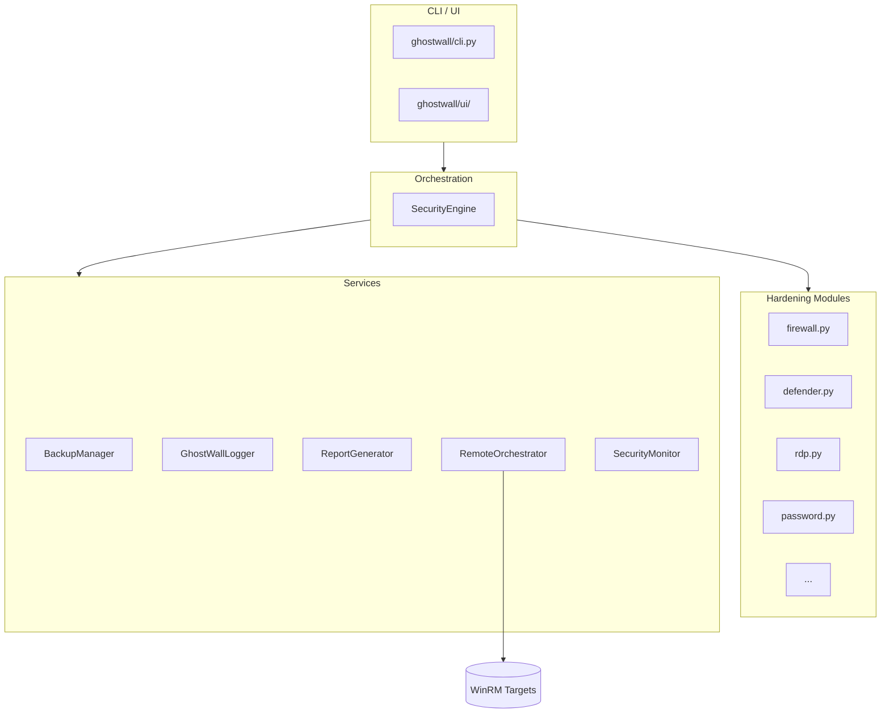

<div align="center">

```
    ██████╗   ██╗  ██╗  ██████╗  ███████╗  ████████╗██╗    ██╗  █████╗  ██╗     ██╗    
    ██╔════╝  ██║  ██║ ██╔═══██╗ ██╔════╝ ╚══██╔══╝ ██║    ██║ ██╔══██╗ ██║     ██║    
    ██║  ███╗ ███████║ ██║   ██║ ███████╗    ██║    ██║ █╗ ██║ ███████║ ██║     ██║    
    ██║   ██║ ██╔══██║ ██║   ██║ ╚════██║    ██║    ██║███╗██║ ██╔══██║ ██║     ██║    
    ╚██████╔╝ ██║  ██║ ╚██████╔╝ ███████║    ██║    ╚███╔███╔╝ ██║  ██║ ███████╗███████╗
    ╚═════╝  ╚═╝  ╚═╝  ╚═════╝  ╚══════╝    ╚═╝     ╚══╝╚══╝  ╚═╝  ╚═╝ ╚══════╝╚══════╝
```

# GhostWall

**Enterprise Windows Security Hardening & Security Orchestration Framework**

[](https://github.com/hakkachhamza/GhostWall/actions/workflows/ci.yml)
[](https://www.python.org/downloads/)
[](LICENSE)
[](https://github.com/psf/black)
[](https://bandit.readthedocs.io/)

A **compliance-mapped**, **rollback-capable**, **multi-host** security hardening
orchestrator for Windows fleets.

[Installation](#installation) •
[Usage](#usage) •
[Architecture](#architecture) •
[Modules](#security-modules) •
[Contributing](CONTRIBUTING.md) •
[Security](SECURITY.md)

</div>

---

## Features

- **12 built-in hardening modules** covering firewall, Defender, RDP, UAC, DEP,
  SMBv1/LLMNR, privacy, guest account, autorun, PowerShell policy, and password policy.
- **Compliance mapping** to CIS Controls v8, MITRE ATT&CK mitigations, and NIST SP 800-53.
- **Atomic backup & rollback** — every control captures pre-change state and can be restored.
- **Encrypted backups** via Fernet (optional `cryptography` dependency).
- **Remote fleet orchestration** over WinRM with threaded execution.
- **Background monitor** that watches for password changes, malware detections, and config drift.
- **Rich interactive UI** with animated banner, progress bars, and status dashboards.
- **Multiple report formats**: HTML, JSON, CSV, PDF.
- **SIEM-ready ECS JSON logging** with rotating file handlers.
- **Plugin system** for custom hardening modules.
- **Windows-compatible** but importable/testable on Linux and macOS.

## Architecture Diagram



## Project Structure

```text
GhostWall/
├── ghostwall/               # Main Python package
│   ├── modules/             # Built-in hardening modules
│   ├── remote/              # WinRM orchestration
│   ├── ui/                  # Rich console UI
│   ├── config/              # Configuration loader
│   ├── plugins/             # Custom plugin directory
│   ├── cli.py               # Entry point
│   ├── engine.py            # Orchestration engine
│   ├── backup.py            # Backup / rollback
│   ├── logger.py            # ECS logging
│   ├── monitor.py           # Background watcher
│   ├── notifications.py     # Toast notifications
│   ├── reports.py           # HTML/JSON/CSV/PDF reports
│   ├── startup.py           # Autostart registration
│   ├── utils.py             # Platform helpers
│   ├── constants.py         # Shared constants
│   └── exceptions.py        # Custom exceptions
├── tests/                   # pytest suite
├── docs/                    # Documentation
├── config/                  # Default config/policy
├── examples/                # Example plugins and targets
├── .github/workflows/       # CI/CD
└── README.md, LICENSE, ...
```

## Installation

```bash
pip install ghostwall
```

For local Windows hardening, install the Windows extras:

```bash
pip install ghostwall[windows]
```

For everything (Windows, encryption, PDF):

```bash
pip install ghostwall[all]
```

See [docs/installation.md](docs/installation.md) for detailed instructions.

## Requirements

- Python 3.9+
- Windows 10/11 or Windows Server 2016+ (for local hardening targets)
- PowerShell 5.1+ or PowerShell 7+
- Administrator privileges (for local hardening)
- WinRM listener on remote targets (for fleet orchestration)

## Usage

### Interactive menu

```bash
ghostwall
```

### Run a full audit

```bash
ghostwall --audit
```

### Dry-run simulation

```bash
ghostwall --audit --dry-run
```

### Show current status

```bash
ghostwall --status
```

### Generate reports

```bash
ghostwall --report --report-format html
ghostwall --report --report-format json
ghostwall --report --report-format csv
ghostwall --report --report-format pdf
ghostwall --report --report-format all
```

### Rollback

```bash
ghostwall --rollback backups/ghostwall_backup_20250101_120000.json
```

### Remote orchestration

```bash
ghostwall --targets examples/targets.txt --transport ntlm
```

### Background monitoring

```bash
# Register monitor to start at every login
ghostwall --install-startup

# Run monitor in foreground
ghostwall --monitor

# Remove autostart entry
ghostwall --uninstall-startup
```

## CLI Commands

| Flag | Description |
|------|-------------|
| `--audit` | Run the full hardening audit |
| `--status` | Show current security posture |
| `--report` | Generate a report |
| `--report-format {html,json,csv,pdf,all}` | Report output format |
| `--dry-run` | Simulate without making changes |
| `-y`, `--yes` | Auto-confirm destructive modules |
| `--rollback FILE` | Restore state from a backup |
| `--encrypt-backup` | Encrypt the backup file |
| `--targets FILE` | Remote target list |
| `--max-workers N` | Concurrent WinRM sessions |
| `--transport {ntlm,kerberos,basic,credssp}` | WinRM transport |
| `--http` | Use HTTP WinRM (not recommended) |
| `--eventlog` | Write completion events to Windows Event Log |
| `--config FILE` | Load custom configuration |
| `--install-startup` | Register monitor autostart |
| `--uninstall-startup` | Remove monitor autostart |
| `--monitor` | Run background monitor |

## Examples

### Audit with encrypted backup

```bash
export GHOSTWALL_BACKUP_KEY="$(python -c "from cryptography.fernet import Fernet; print(Fernet.generate_key().decode())")"
ghostwall --audit --encrypt-backup
```

### Remote hardening with environment credentials

```bash
export GHOSTWALL_REMOTE_USER="CORP\\admin"
export GHOSTWALL_REMOTE_PASS="SecureP@ssw0rd"
ghostwall --targets prod-workstations.txt --max-workers 20
```

## Screenshots

> Screenshots are stored in `screenshots/`. Run GhostWall to generate fresh UI captures.

## Security Modules

| Module | CIS | MITRE | NIST |
|--------|-----|-------|------|
| Firewall Enforcement | v8-4.5, v8-13.1 | M1030, M1037 | SC-7, CM-7 |
| Remote Desktop Lockdown | v8-4.8 | M1042, M1035 | AC-17, CM-7 |
| Ransomware Protection | v8-10.1 | M1040 | SI-3, SI-7 |
| Defender Real-Time Protection | v8-10.1 | M1049 | SI-3 |
| UAC Maximization | v8-4.1, v8-5.4 | M1052 | AC-6, CM-6 |
| DEP Enforcement | v8-10.5 | M1050 | SI-16 |
| Legacy Protocol Removal | v8-4.8, v8-12.1 | M1042 | CM-7, SC-7 |
| Privacy Hardening | v8-3.3 | M1057 | SC-28 |
| Guest Account Lockdown | v8-5.1, v8-5.2 | M1027, M1036 | AC-2, IA-4 |
| Autorun/Autoplay Disable | v8-10.3 | M1042, M1034 | MP-7 |
| PowerShell Script Policy | v8-2.6, v8-8.5 | M1038, M1045 | CM-7, SI-3 |
| Password Policy | v8-5.2, v8-6.1 | M1027 | IA-5, AC-7 |

## Compliance Mapping

GhostWall controls are mapped to:

- **CIS Controls v8** — implementation group 1 / 2 / 3 safeguards
- **MITRE ATT&CK** — mitigation techniques
- **NIST SP 800-53 Rev. 5** — security and privacy controls

## Supported Windows Versions

- Windows 10 (20H2+)
- Windows 11
- Windows Server 2016
- Windows Server 2019
- Windows Server 2022

## Roadmap

- [ ] Group Policy / Intune-aware drift detection
- [ ] Centralized report server / webhook notifications
- [ ] Additional modules (Credential Guard, ASR rules, BitLocker)
- [ ] Ansible / SaltStack integration examples
- [ ] Signed Windows installer

## Contributing

We welcome contributions! Please read [CONTRIBUTING.md](CONTRIBUTING.md) and
[CODE_OF_CONDUCT.md](CODE_OF_CONDUCT.md) before opening issues or pull requests.

## License

GhostWall is released under the [MIT License](LICENSE).

## Acknowledgements

- [Rich](https://github.com/Textualize/rich) for the beautiful terminal UI.
- [pywinrm](https://github.com/diyan/pywinrm) for remote Windows management.
- CIS, MITRE, and NIST for publicly available control frameworks.

## FAQ

**Q: Can GhostWall run on Linux or macOS?**

The orchestrator package imports cleanly on any OS, but local hardening
requires Windows. Remote WinRM orchestration can be driven from Linux/macOS.

**Q: Does GhostWall require admin rights?**

Yes, for local hardening. Remote orchestration requires admin credentials on
each target.

**Q: Will GhostWall break my system?**

Use `--dry-run` first. Destructive modules are flagged and require confirmation
unless `--yes` is used. Rollback backups are created automatically.

**Q: Can I add my own hardening controls?**

Yes. Drop a plugin file into `ghostwall/plugins/` or configure a custom plugins
 directory. See [docs/plugin-development.md](docs/plugin-development.md).
