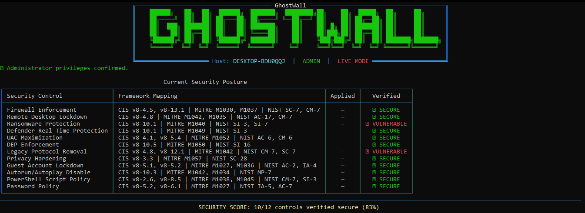
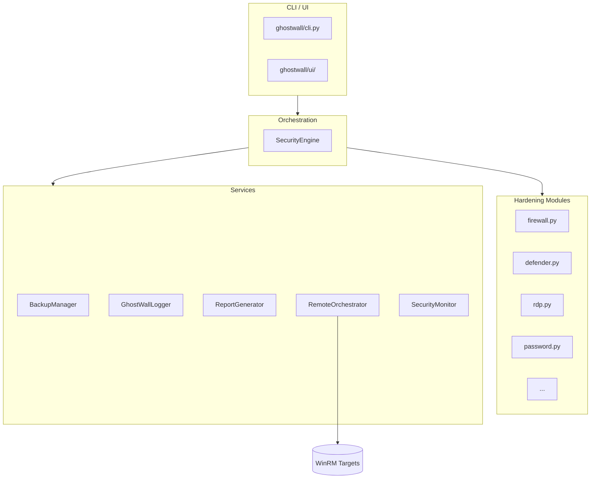

<div align="center">

```
    ██████╗   ██╗  ██╗  ██████╗  ███████╗  ████████╗██╗    ██╗  █████╗  ██╗     ██╗
    ██╔════╝  ██║  ██║ ██╔═══██╗ ██╔════╝ ╚══██╔══╝ ██║    ██║ ██╔══██╗ ██║     ██║
    ██║  ███╗ ███████║ ██║   ██║ ███████╗    ██║    ██║ █╗ ██║ ███████║ ██║     ██║
    ██║   ██║ ██╔══██║ ██║   ██║ ╚════██║    ██║    ██║███╗██║ ██╔══██║ ██║     ██║
    ╚██████╔╝ ██║  ██║ ╚██████╔╝ ███████║    ██║    ╚███╔███╔╝ ██║  ██║ ███████╗███████╗
    ╚═════╝  ╚═╝  ╚═╝  ╚═════╝  ╚══════╝    ╚═╝     ╚══╝╚══╝  ╚═╝  ╚═╝ ╚══════╝╚══════╝
```

# GhostWall

**Enterprise Windows Security Hardening & Security Orchestration Framework**

[](https://github.com/hakkachhamza/GhostWall/actions/workflows/ci.yml)
[](https://www.python.org/downloads/)
[](LICENSE)
[](https://github.com/psf/black)
[](https://bandit.readthedocs.io/)

A **compliance-mapped**, **rollback-capable**, **multi-host** security hardening
orchestrator for Windows fleets.

[Installation](#installation) •
[Usage](#usage) •
[How It Works](#how-it-works) •
[Architecture](#architecture) •
[Security Modules](#security-modules) •
[Reporting](#reports) •
[FAQ](#faq)

</div>

---



---

## Table of Contents

- [Overview](#overview)
- [Features](#features)
- [How It Works](#how-it-works)
- [Architecture](#architecture)
- [Project Structure](#project-structure)
- [Requirements](#requirements)
- [Installation](#installation)
- [Usage](#usage)
- [CLI Reference](#cli-reference)
- [Configuration](#configuration)
- [Reports](#reports)
- [Backup & Rollback](#backup--rollback)
- [Remote Orchestration](#remote-orchestration)
- [Background Monitoring](#background-monitoring)
- [Plugin System](#plugin-system)
- [Compliance Mapping](#compliance-mapping)
- [Development](#development)
- [Continuous Integration](#continuous-integration)
- [Contributing](#contributing)
- [License](#license)
- [FAQ](#faq)

---

## Overview

GhostWall is a Python-based security framework that hardens Windows machines
against common attack vectors. It is designed for:

- **System administrators** who manage fleets of Windows workstations and servers.
- **SOC / security teams** who need measurable, compliance-aligned baselines.
- **Auditors** who need repeatable, documented evidence of security posture.

GhostWall applies hardening settings through 12 built-in modules, captures the
previous state of every change, and can fully **roll back** those changes at any
time. Every control is tagged with its **CIS Controls v8**, **MITRE ATT&CK**,
and **NIST SP 800-53** references so you can map results directly to the audit
frameworks your organization follows.

The package imports cleanly on any operating system. Local hardening runs on
Windows; remote orchestration via **WinRM** can be driven from Windows, Linux,
or macOS.

---

## Features

- **12 built-in hardening modules** covering firewall, Defender, RDP, UAC, DEP,
  SMBv1/LLMNR, privacy, guest account, autorun, PowerShell policy, and password
  policy.
- **Compliance mapping** to CIS Controls v8, MITRE ATT&CK mitigations, and
  NIST SP 800-53 controls — visible in every report.
- **Atomic backup & rollback** — every control captures pre-change state and can
  be restored with a single command.
- **Encrypted backups** via Fernet (optional `cryptography` dependency).
- **Remote fleet orchestration** over WinRM with threaded execution and an
  adjustable worker pool.
- **Background monitor** that watches for password changes, malware detections,
  and configuration drift.
- **Rich interactive UI** with an animated banner, progress bars, and status
  dashboards (built on `rich`).
- **Multiple report formats**: HTML, JSON, CSV, PDF.
- **SIEM-ready ECS JSON logging** with rotating file handlers.
- **Plugin system** for custom hardening modules — drop a file in `plugins/` and
  it is loaded automatically.
- **Windows-compatible** but importable and testable on Linux and macOS.

---

## How It Works

The flow of a typical GhostWall run:

1. **CLI parsing** — `ghostwall/cli.py` reads arguments and builds a
   `SecurityEngine`.
2. **Module discovery** — the engine loads the 12 built-in modules from
   `ghostwall/modules/` and scans `ghostwall/plugins/` for custom plugins.
3. **Backup** — before any change, the engine captures the current state of each
   control through `ghostwall/backup.py` (`BackupManager`).
4. **Apply** — each module runs its `audit()` check, then `apply()` to harden the
   setting (PowerShell commands, registry writes, or BCD edits executed via
   `ghostwall/utils.py`).
5. **Verify** — modules re-check the state to confirm the change took effect.
6. **Log** — results are written to rotating text logs and ECS-JSON logs
   (`ghostwall/logger.py`) suitable for SIEM ingestion.
7. **Report** — a summary can be exported as HTML, JSON, CSV, or PDF
   (`ghostwall/reports.py`).
8. **Rollback** — if anything goes wrong, `ghostwall --rollback <file>` restores
   the exact captured pre-change state.

Every module uses a shared base class (`SecurityModuleBase`) that guarantees a
consistent `audit` → `apply` → `verify` lifecycle and enforces the dry-run
contract so nothing changes without `--audit` (non-dry) mode.

---

## Architecture



### Layers

```text
┌─────────────────────────────────────────────────────────────┐
│                         CLI / UI                            │
│  ghostwall/cli.py  |  ghostwall/ui/                         │
├─────────────────────────────────────────────────────────────┤
│                      Security Engine                         │
│  ghostwall/engine.py — orchestration, audit, rollback        │
├─────────────────────────────────────────────────────────────┤
│                    Hardening Modules                         │
│  ghostwall/modules/ — firewall, defender, rdp, uac, ...      │
├─────────────────────────────────────────────────────────────┤
│         Backup / Logging / Reports / Notifications           │
│  ghostwall/backup.py, logger.py, reports.py, notifications   │
├─────────────────────────────────────────────────────────────┤
│              Remote Orchestration (WinRM)                    │
│  ghostwall/remote/orchestrator.py, winrm.py                  │
├─────────────────────────────────────────────────────────────┤
│              Plugins / Configuration                         │
│  ghostwall/plugins/, ghostwall/config/                       │
├─────────────────────────────────────────────────────────────┤
│           Windows-specific execution helpers                 │
│  ghostwall/utils.py — PowerShell, registry, WMI              │
└─────────────────────────────────────────────────────────────┘
```

### Design principles

- **Separation of concerns** — CLI, engine, modules, and reports are independent.
- **Guarded imports** — all Windows-only imports are optional so the package
  imports cleanly on any OS.
- **Dry-run first** — every module supports `--dry-run` simulation.
- **Rollback capable** — every module captures and restores its pre-change state.
- **Compliance mapped** — each control is tagged with CIS, MITRE, and NIST
  references.
- **Extensible** — custom modules are loaded automatically from the plugins dir.

---

## Project Structure

```text
GhostWall/
├── ghostwall/               # Main Python package
│   ├── modules/             # Built-in hardening modules
│   ├── remote/              # WinRM orchestration (orchestrator.py, winrm.py)
│   ├── ui/                  # Rich console UI (banner, dashboards)
│   ├── plugins/             # Custom plugin directory (auto-loaded)
│   ├── cli.py               # Command-line entry point
│   ├── engine.py            # Orchestration engine
│   ├── backup.py            # Backup / rollback manager
│   ├── logger.py            # Rotating text + ECS JSON logging
│   ├── monitor.py           # Background watcher
│   ├── notifications.py     # Toast notifications
│   ├── reports.py           # HTML / JSON / CSV / PDF reports
│   ├── startup.py           # Autostart registration (scheduled tasks)
│   ├── utils.py             # PowerShell, registry, WMI helpers
│   ├── constants.py         # Shared constants & compliance mappings
│   ├── exceptions.py        # Custom exceptions
│   └── py.typed             # PEP 561 marker for type checkers
├── tests/                   # pytest suite (unit tests + conftest)
├── docs/                    # Documentation (installation, architecture, plugins…)
├── config/                  # Default configuration & policy
│   ├── config.json          # Runtime settings
│   └── policy.json          # Hardening policy values
├── examples/                # Example plugins and WinRM targets file
├── backups/                 # Backup files (auto-generated)
├── reports/                 # Generated reports
├── logs/                    # Rotating logs + ECS JSON
├── assets/                  # Static assets
├── screenshots/             # UI screenshots
├── .github/workflows/       # CI / CD pipelines
├── Makefile                 # Dev/build shortcuts
├── pyproject.toml           # Packaging / tool config
├── requirements.txt         # Dependency list
└── README.md, LICENSE, ...
```

---

## Requirements

### Host running GhostWall

- Python 3.9 or newer
- `pip`

### Target Windows hosts (for local hardening)

- Windows 10 (20H2+), Windows 11, or Windows Server 2016 / 2019 / 2022
- PowerShell 5.1 or PowerShell 7+
- Administrator privileges
- WinRM listener enabled (for remote orchestration only)

### Remote orchestration driver

- Windows, Linux, or macOS with Python 3.9+ and network access to targets.

---

## Installation

### From PyPI

```bash
pip install ghostwall
```

### From source

```bash
git clone https://github.com/hakkachhamza/GhostWall.git
cd GhostWall
pip install -e .
```

### Optional extras

```bash
# Windows-only integrations (pywin32, wmi)
pip install -e ".[windows]"

# Encrypted Fernet backups
pip install -e ".[encrypt]"

# PDF reports
pip install -e ".[pdf]"

# Everything (Windows + encryption + PDF)
pip install -e ".[all]"

# Development / testing toolchain
pip install -e ".[dev]"
```

### Verify the installation

```bash
ghostwall --help
python -m ghostwall.cli --status
```

> **Windows troubleshooting note:** If you see
> `Fatal error in launcher: Unable to create process`, the `ghostwall.exe`
> launcher is stale and points to an old/moved Python installation. Fix it by
> removing the old `ghostwall.exe`/`gw.exe` from your PATH and reinstalling:

```bash
python -m pip uninstall ghostwall -y
python -m pip install -e ".[all]"
```

---

## Usage

### Interactive menu

```bash
ghostwall
```

### Run a full audit (applies hardening)

```bash
ghostwall --audit
```

### Simulate an audit without changing anything

```bash
ghostwall --audit --dry-run
```

> **Always run `--dry-run` first.** Destructive modules are flagged and require
> confirmation unless you pass `-y`. Rollback backups are created automatically.

### Show current security posture

```bash
ghostwall --status
```

### Generate a report

```bash
ghostwall --report --report-format html     # default
ghostwall --report --report-format json
ghostwall --report --report-format csv
ghostwall --report --report-format pdf
ghostwall --report --report-format all      # every format at once
```

### Roll back to a previous state

```bash
ghostwall --rollback backups/ghostwall_backup_20250101_120000.json
```

### Remote orchestration

```bash
ghostwall --targets examples/targets.txt --transport ntlm
ghostwall --targets examples/targets.txt --transport kerberos --max-workers 20
```

### Background monitoring

```bash
# Register the monitor to start at every login
ghostwall --install-startup

# Run the monitor in the foreground
ghostwall --monitor

# Remove the autostart entry
ghostwall --uninstall-startup
```

### Audit with encrypted backup

```bash
# Linux / macOS (cmd on Windows: set GHOSTWALL_BACKUP_KEY=...)
export GHOSTWALL_BACKUP_KEY="$(python -c "from cryptography.fernet import Fernet; print(Fernet.generate_key().decode())")"
ghostwall --audit --encrypt-backup
```

### Remote hardening with environment credentials

```bash
export GHOSTWALL_REMOTE_USER="CORP\\admin"
export GHOSTWALL_REMOTE_PASS="SecureP@ssw0rd"
ghostwall --targets prod-workstations.txt --max-workers 20
```

---

## CLI Reference

| Flag | Description |
|------|-------------|
| `--audit` | Run the full hardening audit |
| `--status` | Show the current security posture only |
| `--report` | Generate a report |
| `--report-format {html,json,csv,pdf,all}` | Report output format (default: html) |
| `--dry-run` | Simulate every action without changing the system |
| `-y`, `--yes` | Auto-confirm destructive modules |
| `--rollback FILE` | Restore state from a `ghostwall_backup_*.json` file |
| `--encrypt-backup` | Encrypt the backup file with Fernet (needs `cryptography`) |
| `--targets FILE` | Remote target list (one hostname/IP per line) |
| `--max-workers N` | Concurrent WinRM sessions (default: 10) |
| `--transport {ntlm,kerberos,basic,credssp}` | WinRM transport (default: ntlm) |
| `--http` | Use HTTP WinRM instead of HTTPS (not recommended) |
| `--eventlog` | Write completion events to the Windows Event Log |
| `--config FILE` | Load a custom configuration file |
| `--install-startup` | Register the monitor autostart entry |
| `--uninstall-startup` | Remove the monitor autostart entry |
| `--monitor` | Run the background monitor |

---

## Configuration

GhostWall ships with two JSON configuration files in `config/`:

- **`config/config.json`** — runtime settings (paths, polling intervals, worker
  counts, logging defaults).
- **`config/policy.json`** — the hardening policy values (e.g. minimum password
  length, lockout threshold) used by the modules.

You can override the runtime configuration with `--config <file>`.

Related environment variables:

| Variable | Purpose |
|----------|---------|
| `GHOSTWALL_BACKUP_KEY` | Fernet key used to encrypt/decrypt backups |
| `GHOSTWALL_REMOTE_USER` | Username for WinRM orchestration |
| `GHOSTWALL_REMOTE_PASS` | Password for WinRM orchestration |

---

## Reports

Reports are generated by `ghostwall/reports.py` (`ReportGenerator`) and written
to `reports/`. Available formats:

| Format | Command |
|--------|---------|
| HTML | `ghostwall --report --report-format html` |
| JSON | `ghostwall --report --report-format json` |
| CSV | `ghostwall --report --report-format csv` |
| PDF | `ghostwall --report --report-format pdf` |
| All of the above | `ghostwall --report --report-format all` |

Reports include per-module results, pass/fail status, compliance references
(CIS / MITRE / NIST), and the overall security score.

---

## Backup & Rollback

Every hardening run captures the pre-change state of each control before
applying changes. Backups are written to `backups/` as
`ghostwall_backup_<timestamp>.json` and can optionally be encrypted with Fernet.

To restore any previous state:

```bash
ghostwall --rollback backups/ghostwall_backup_20250101_120000.json
```

This applies to both local runs and remote orchestration per-target.

---

## Remote Orchestration

GhostWall drives multiple Windows hosts over **WinRM** (`ghostwall/remote/`):

- `orchestrator.py` — threads a pool of workers (`--max-workers`) across the
  target list and collects per-host results.
- `winrm.py` — thin wrapper around `pywinrm` with transport selection.

```bash
# Targets file: one hostname or IP per line
ghostwall --targets examples/targets.txt --transport ntlm --max-workers 20
```

Supported transports: `ntlm` (default), `kerberos`, `basic`, `credssp`.
Use `--http` only when a WinRM listener is configured on HTTP and you accept the
security trade-off; the default is HTTPS.

---

## Background Monitoring

The `SecurityMonitor` (`ghostwall/monitor.py`) watches for:

- Password policy changes
- Malware detections
- Configuration drift in hardened settings

```bash
ghostwall --install-startup   # register monitor to start at login
ghostwall --monitor           # run it now
ghostwall --uninstall-startup # remove the autostart entry
```

---

## Plugin System

You can add custom hardening controls without touching the core package.

1. Create a file in `ghostwall/plugins/` (or a directory configured in the
   runtime config).
2. Subclass `SecurityModuleBase` from `ghostwall/modules/base.py` and implement
   the `audit()` / `apply()` contract, optionally mapping your control to
   CIS / MITRE / NIST references.
3. The engine discovers and runs your plugin automatically on the next audit.

See [docs/plugin-development.md](docs/plugin-development.md) and the example in
`examples/custom_plugin.py` for a complete walkthrough.

---

## Security Modules

| Module | What it hardens | CIS | MITRE | NIST |
|--------|-----------------|-----|-------|------|
| Firewall Enforcement | Enables Windows Firewall on all profiles; inbound=block, outbound=allow | v8-4.5, v8-13.1 | M1030, M1037 | SC-7, CM-7 |
| Remote Desktop Lockdown | Disables Remote Desktop (TermService) and blocks new RDP connections | v8-4.8 | M1042, M1035 | AC-17, CM-7 |
| Ransomware Protection | Enables Microsoft Defender Controlled Folder Access | v8-10.1 | M1040 | SI-3, SI-7 |
| Defender Real-Time Protection | Ensures Microsoft Defender real-time monitoring is enabled | v8-10.1 | M1049 | SI-3 |
| UAC Maximization | Sets UAC to "Always Notify" | v8-4.1, v8-5.4 | M1052 | AC-6, CM-6 |
| DEP Enforcement | Enables Data Execution Prevention for all processes via BCD | v8-10.5 | M1050 | SI-16 |
| Legacy Protocol Removal | Disables SMBv1 and LLMNR broadcast name resolution | v8-4.8, v8-12.1 | M1042 | CM-7, SC-7 |
| Privacy Hardening | Reduces telemetry level and disables the advertising ID | v8-3.3 | M1057 | SC-28 |
| Guest Account Lockdown | Disables the built-in Guest account | v8-5.1, v8-5.2 | M1027, M1036 | AC-2, IA-4 |
| Autorun/Autoplay Disable | Disables Autorun and Autoplay for all drives | v8-10.3 | M1042, M1034 | MP-7 |
| PowerShell Script Policy | Sets the machine-wide execution policy to RemoteSigned | v8-2.6, v8-8.5 | M1038, M1045 | CM-7, SI-3 |
| Password Policy | Enforces min length 14, max age 30 days, lockout after 3 attempts | v8-5.2, v8-6.1 | M1027 | IA-5, AC-7 |

---

## Compliance Mapping

GhostWall controls are mapped to three frameworks at the module level and the
reference appears in every log line and report:

- **CIS Controls v8** — implementation groups 1 / 2 / 3 safeguards
- **MITRE ATT&CK** — mitigation techniques
- **NIST SP 800-53 Rev. 5** — security and privacy controls

This lets you generate audit-ready evidence instead of manual configuration
checklists.

---

## Development

### Setup

```bash
pip install -e ".[dev]"
```

### Makefile shortcuts

| Target | Command |
|--------|---------|
| Install (prod) | `make install` |
| Install dev | `make install-dev` |
| Install everything | `make install-all` |
| Run tests | `make test` |
| Lint (flake8 + mypy) | `make lint` |
| Format check | `make format` |
| Format (apply) | `make format-fix` |
| Security scan (bandit + safety) | `make security` |
| Build distribution | `make build` |
| Run interactive menu | `make run` |
| Dry-run audit | `make dry-run` |
| Show status | `make status` |
| Generate HTML report | `make report` |
| Clean artifacts | `make clean` |

Or run the tools directly:

```bash
python -m pytest -v                        # tests
python -m flake8 ghostwall tests           # lint
python -m mypy ghostwall                   # type checks
python -m black --check ghostwall tests    # format check
python -m bandit -r ghostwall              # security scan
python -m safety check                     # dependency vulnerabilities
python -m build                            # build sdist + wheel
```

Kitchen-sink install of everything:

```bash
python -m pip install -e ".[all,dev]"
```

---

## Continuous Integration

The repository includes a GitHub Actions workflow (`.github/workflows/ci.yml`)
that runs automatically on push / pull request to `main` and `develop`:

| Job | What it does |
|-----|--------------|
| `lint` | flake8 + mypy + black (check) on Python 3.11 |
| `security` | Bandit static analysis + Safety dependency scan |
| `test` | pytest with coverage on Python 3.9–3.12 across Ubuntu and Windows |
| `build` | Builds the wheel and sdist, uploads `dist/` as an artifact |

The CI badge in this file reflects the latest run.

---

## Contributing

Contributions are welcome. Please read
[CONTRIBUTING.md](CONTRIBUTING.md) and
[CODE_OF_CONDUCT.md](CODE_OF_CONDUCT.md) before opening issues or pull
requests, and run the full lint + test + security suite locally first.

---

## License

GhostWall is released under the [MIT License](LICENSE).

---

## Acknowledgements

- [Rich](https://github.com/Textualize/rich) for the beautiful terminal UI.
- [pywinrm](https://github.com/diyan/pywinrm) for remote Windows management.
- CIS, MITRE, and NIST for publicly available control frameworks.

---

## FAQ

**Q: Can GhostWall run on Linux or macOS?**

The orchestrator package imports cleanly on any OS, but local hardening requires
Windows. Remote WinRM orchestration can be driven from Linux or macOS.

**Q: Does GhostWall require admin rights?**

Yes, administrators privileges are required for local hardening. Remote
orchestration requires administrative credentials on each target.

**Q: Will GhostWall break my system?**

Use `--dry-run` first. Destructive modules are flagged and require confirmation
unless `--yes` is used. Rollback backups are created automatically before any
change, and `--rollback` restores them.

**Q: Can I add my own hardening controls?**

Yes. Drop a plugin file into `ghostwall/plugins/` (or a configured plugins
directory) and subclass `SecurityModuleBase`. See
[docs/plugin-development.md](docs/plugin-development.md).

**Q: What Python versions are supported?**

Python 3.9 through 3.12 are tested in CI. Newer versions (e.g. 3.14) generally
work as well.

**Q: How do I fix `Fatal error in launcher` on Windows?**

Your `ghostwall.exe` points to an old or removed Python. Uninstall and reinstall
with the current interpreter:

```bash
python -m pip uninstall ghostwall -y
python -m pip install -e ".[all]"
```

**Q: Where do reports and backups go?**

Reports go to `reports/`, backups to `backups/`, and logs to `logs/`.